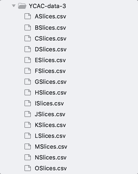

# YCAC-data-pitchSetFinder
Script allows find sets of pitches by user defined interval value of offset.

## Installing
Please install pip and run command line below in the same directory where 'requirements.txt' exists in order to install packages required to run. - ignored. install manually
```
$ pip install -r requirements.txt 
```
# YCAC-data-splitter
Script allows split and organize YCAC data frame by titles and composers 

## Installing
Please install pip and run command line below in the same directory where 'requirements.txt' exists in order to install packages required to run.
```
$ pip install -r requirements.txt 
```
## Running the tests
Command looks like
```
$ python splitter.py -i directory_name
```
>for example:
```
$ python splitter.py -i YCAC-data-1
```
>Auto dir generator by composer's names
>>

>Generating .csv files by title
>>

## Input & Output
Input
>Link to Yale Classical Archives
>>https://ycac.yale.edu/

Output
>Link to Google drive(private)

>Single csv file name format : "title by composer.csv"
>>https://drive.google.com/file/d/1NWwg0FcHZgk-8is8u8rEdqMOwYFiC0YT/view?usp=sharing


**KEY FINDING**\
A windowed key-profile analysis was performed with music21 using the Krumhansl-Schmuckler (KS) key-finding algorithm and the Bellman-Budge key pro- files (see Krumhansl 1990, Bellman 2005, and Cuthbert and Ariza 2011).
Windows were 8 slices in length. Thus each slice was analyed in 8 windows.
If a slice was analyzed in two different keys in two dif- ferent windows and the maximal KS confidence values for the two keys was 0.1 or less, no local key was re- corded. Otherwise the key producing maximal KS confi- dence was recorded as the Local Key for the slice.

**WHAT’S A “SLICE”?**
“Salami slicing” is our term for a cheap way of dealing with polyphonic data. A new slice is drawn whenever a note enters or leaves the texture. Music21 calls this “chordifying.”

## Usage

Use the package manager [pip](https://pip.pypa.io/en/stable/) to install library indicates below.

```python
import sys
import re

import csv
import os
import math
import ast
import argparse
import seaborn as sns
import matplotlib
import scipy.stats as stats
import statsmodels.api as sm
import pandas as pd
import numpy as np
import matplotlib.pyplot as plt

from pandas.plotting import table
from sklearn.cluster import KMeans
from sklearn.preprocessing import LabelEncoder
from sklearn.preprocessing import MinMaxScaler
from matplotlib import cm
from sklearn.cluster import SpectralClustering
from sklearn.metrics import pairwise_distances

from statsmodels.formula.api import ols
from scipy.fft import fft, ifft
from sklearn.cluster import KMeans
from ast import literal_eval
from scipy.fft import fft, ifft
```


## STAGE
**Stage 1**\
The sample data frame looks like this below.

op1no1minuet.csv
```
offset	Chord	NormalForm	PCsInNormalForm	GlobalScaleDegrees	HighestPitch	LowestPitch	file	Composer	LocalTonic	LocalMode	LocalSDForm_BassSD	Confidence
0	<music21.chord.Chord B-4 D4 B-3 B-2>	[0, 4]	[10, 2]	[0, 4]	70	46	String Quartet Op1 No1 ii Bb major.mid	Haydn	Ambiguous	Ambiguous	Ambiguous	0
0.625	<music21.chord.Chord B-4 D4>	[0, 4]	[10, 2]	[0, 4]	70	62	String Quartet Op1 No1 ii Bb major.mid	Haydn	Ambiguous	Ambiguous	Ambiguous	0
1	<music21.chord.Chord B-4 D4 B-3 B-2>	[0, 4]	[10, 2]	[0, 4]	70	46	String Quartet Op1 No1 ii Bb major.mid	Haydn	Ambiguous	Ambiguous	Ambiguous	0
1.625	<music21.chord.Chord B-4 D4>	[0, 4]	[10, 2]	[0, 4]	70	62	String Quartet Op1 No1 ii Bb major.mid	Haydn	Ambiguous	Ambiguous	Ambiguous	0
2	<music21.chord.Chord B-5 G4 B-3 B-2>	[0, 3]	[7, 10]	[9, 0]	82	46	String Quartet Op1 No1 ii Bb major.mid	Haydn	Ambiguous	Ambiguous	Ambiguous	0
2.625	<music21.chord.Chord B-5 G4>	[0, 3]	[7, 10]	[9, 0]	82	67	String Quartet Op1 No1 ii Bb major.mid	Haydn	Ambiguous	Ambiguous	Ambiguous	0
3	<music21.chord.Chord B-5 G4 B-3 B-2>	[0, 3]	[7, 10]	[9, 0]	82	46	String Quartet Op1 No1 ii Bb major.mid	Haydn	Ambiguous	Ambiguous	Ambiguous	0
3.5	<music21.chord.Chord A5 F4 B-3 B-2>	[0, 4, 5]	[5, 9, 10]	[7, 11, 0]	81	46	String Quartet Op1 No1 ii Bb major.mid	Haydn	Ambiguous	Ambiguous	Ambiguous	0
3.625	<music21.chord.Chord A5 F4>	[0, 4]	[5, 9]	[7, 11]	81	65	String Quartet Op1 No1 ii Bb major.mid	Haydn	Ambiguous	Ambiguous	Ambiguous	0
```

We counted the unique pitch(of the octave) set along with the quarter note by the offset column and chord. Then, we transformed the sets into an array which looks like [C,C#,D,E-,E,F,F#,G,G#,A,B-,B].\
op2no2minuet.csv

```
offsetRange	[C,C#,D,E-,E,F,F#,G,G#,A,B-,B]	triadLabel	triadCoef	coefList
42.0 to 42.0	[0, 0, 1, 0, 0, 0, 0, 0, 0, 0, 0, 2]	gMajor	0.727606875	[val,val,val,val,val,val,val,val,val,val,val,val,val,val,val,val,val,val,val,val,val,val,val,val]
43.0 to 43.5	[0, 0, 2, 0, 0, 0, 0, 0, 2, 0, 0, 2]	eMajor	0.555555556	[val,val,val,val,val,val,val,val,val,val,val,val,val,val,val,val,val,val,val,val,val,val,val,val]
44.0 to 44.75	[0, 2, 2, 0, 0, 0, 0, 0, 0, 4, 0, 2]	aMinor	0.52615222	[val,val,val,val,val,val,val,val,val,val,val,val,val,val,val,val,val,val,val,val,val,val,val,val]
45.0 to 45.875	[0, 0, 3, 0, 2, 0, 2, 0, 2, 0, 0, 0]	dMajor	0.485661864	[val,val,val,val,val,val,val,val,val,val,val,val,val,val,val,val,val,val,val,val,val,val,val,val]
46.0 to 46.0	[0, 2, 0, 0, 2, 0, 0, 0, 0, 0, 0, 0]	aMajor	0.774596669	[val,val,val,val,val,val,val,val,val,val,val,val,val,val,val,val,val,val,val,val,val,val,val,val]
```
refer:[numpy.corrcoef](https://numpy.org/doc/stable/reference/generated/numpy.corrcoef.html)\
Here, we could find the closest triad of each quarter note based on the correlation coefficient result out of the pitch count list. coefList value replaced with 'val' in this documentation

&nbsp;&nbsp;


**Stage 2**\
Combined all the output from 24 pieces of Minuet composed by Haydn form into a single data frame with the original file name label for the next step.\
haydnDF.csv
```
offsetRange	[C,C#,D,E-,E,F,F#,G,G#,A,B-,B]	triadLabel	triadCoef	coefList	filename
204.0 to 204.0	[0, 0, 0, 2, 0, 0, 0, 0, 0, 0, 0, 0]	e-Major	0.522232968	[val,val,val,val,val,val,val,val,val,val,val,val,val,val,val,val,val,val,val,val,val,val,val,val]	op1no1trio.csv
206.0 to 206.0	[0, 0, 1, 0, 0, 1, 0, 0, 0, 0, 0, 0]	b-Major	0.774596669	[val,val,val,val,val,val,val,val,val,val,val,val,val,val,val,val,val,val,val,val,val,val,val,val]	op1no1trio.csv
207.0 to 207.0	[0, 0, 0, 1, 0, 0, 0, 1, 0, 0, 0, 0]	e-Major	0.774596669	[val,val,val,val,val,val,val,val,val,val,val,val,val,val,val,val,val,val,val,val,val,val,val,val]	op1no1trio.csv
209.0 to 209.0	[0, 0, 0, 0, 0, 0, 0, 1, 0, 0, 1, 0]	e-Major	0.774596669	[val,val,val,val,val,val,val,val,val,val,val,val,val,val,val,val,val,val,val,val,val,val,val,val]	op1no1trio.csv
210.0 to 210.0	[0, 0, 0, 1, 0, 0, 0, 1, 0, 0, 0, 0]	e-Major	0.774596669	[val,val,val,val,val,val,val,val,val,val,val,val,val,val,val,val,val,val,val,val,val,val,val,val]	op1no1trio.csv
211.0 to 211.0	[0, 0, 0, 1, 0, 0, 0, 0, 0, 0, 1, 0]	e-Major	0.774596669	[val,val,val,val,val,val,val,val,val,val,val,val,val,val,val,val,val,val,val,val,val,val,val,val]	op1no1trio.csv
212.0 to 212.0	[0, 0, 0, 0, 0, 0, 0, 1, 0, 0, 1, 0]	e-Major	0.774596669	[val,val,val,val,val,val,val,val,val,val,val,val,val,val,val,val,val,val,val,val,val,val,val,val]	op1no1trio.csv
```


**Stage 3**\
entireDF_DFF.csv

```
offsetRange	[C,C#,D,E-,E,F,F#,G,G#,A,B-,B]	triadLabel	triadCoef	coefList	filename	y_list	abs_y_list	yinv_list	abs_yinv_list
204.0 to 204.0	[0, 0, 0, 2, 0, 0, 0, 0, 0, 0, 0, 0]	e-Major	0.522232968	[-0.17407765595569788, -0.17407765595569788, -0.17407765595569785, 0.5222329678670937, -0.17407765595569788, -0.17407765595569788, -0.17407765595569788, -0.17407765595569788, 0.5222329678670936, -0.17407765595569788, -0.17407765595569785, 0.5222329678670937, -0.17407765595569788, -0.17407765595569788, -0.17407765595569788, 0.5222329678670936, -0.17407765595569788, -0.17407765595569788, 0.5222329678670937, -0.17407765595569788, -0.17407765595569788, -0.17407765595569788, -0.17407765595569788, 0.5222329678670936]	op1no1trio.csv	[(nan-0j), (nan+nanj), (nan+nanj), (nan+nanj), (nan+nanj), (nan+nanj), (nan-0j), (nan+nanj), (nan+nanj), (nan+nanj), (nan+nanj), (nan+nanj)]	[nan, nan, nan, nan, nan, nan, nan, nan, nan, nan, nan, nan]	[(nan+nanj), (nan+nanj), (nan+nanj), (nan+nanj), (nan+nanj), (nan+nanj), (nan+nanj), (nan+nanj), (nan+nanj), (nan+nanj), (nan+nanj), (nan+nanj)]	[nan, nan, nan, nan, nan, nan, nan, nan, nan, nan, nan, nan]
206.0 to 206.0	[0, 0, 1, 0, 0, 1, 0, 0, 0, 0, 0, 0]	b-Major	0.774596669	[-0.25819888974716115, 0.25819888974716104, 0.25819888974716104, -0.25819888974716115, -0.2581988897471611, 0.25819888974716104, -0.2581988897471611, 0.25819888974716104, -0.25819888974716115, -0.25819888974716115, 0.7745966692414831, -0.25819888974716115, -0.25819888974716115, 0.25819888974716104, 0.25819888974716104, -0.25819888974716115, -0.25819888974716115, 0.7745966692414831, -0.25819888974716115, -0.25819888974716115, 0.25819888974716104, -0.2581988897471611, 0.25819888974716104, -0.2581988897471611]	op1no1trio.csv	[-0j, (-0.3660254037844386+0.6339745962155614j), (2+0j), (-1-3j), (-3+1.7320508075688772j), (1.3660254037844386+2.3660254037844384j), (2-0j), (1.3660254037844386-2.3660254037844384j), (-3-1.7320508075688772j), (-1+3j), (2-0j), (-0.3660254037844386-0.6339745962155614j)]	[0.0, 0.7320508075688773, 2.0, 3.1622776601683795, 3.4641016151377544, 2.7320508075688767, 2.0, 2.7320508075688767, 3.4641016151377544, 3.1622776601683795, 2.0, 0.7320508075688773]	[0j, (7.401486830834377e-17+0j), (1+0j), (-2+0j), (-3.204937810639273e-17+0j), (1+0j), (3.700743415417188e-17+0j), -6.409875621278546e-17j, (3.204937810639273e-17+0j), (7.401486830834377e-17+0j), (3.700743415417188e-17-0j), 6.409875621278546e-17j]	[0.0, 7.401486830834377e-17, 1.0, 2.0, 3.204937810639273e-17, 1.0, 3.700743415417188e-17, 6.409875621278546e-17, 3.204937810639273e-17, 7.401486830834377e-17, 3.700743415417188e-17, 6.409875621278546e-17]
207.0 to 207.0	[0, 0, 0, 1, 0, 0, 0, 1, 0, 0, 0, 0]	e-Major	0.774596669	[0.25819888974716104, -0.2581988897471611, -0.2581988897471611, 0.7745966692414831, -0.25819888974716115, -0.2581988897471611, -0.2581988897471611, 0.25819888974716104, 0.25819888974716104, -0.2581988897471611, -0.2581988897471611, 0.25819888974716104, -0.2581988897471611, -0.25819888974716115, -0.25819888974716115, 0.7745966692414831, -0.2581988897471611, -0.2581988897471611, 0.25819888974716104, 0.25819888974716104, -0.2581988897471611, -0.2581988897471611, 0.25819888974716104, 0.25819888974716104]	op1no1trio.csv	[-0j, (-0.5+0.8660254037844385j), (-0.4999999999999999-0.8660254037844386j), (1+3j), (1.5-2.598076211353316j), (-0.5-0.8660254037844387j), (-2-0j), (-0.5+0.8660254037844387j), (1.5+2.598076211353316j), (1-3j), (-0.4999999999999999+0.8660254037844386j), (-0.5-0.8660254037844385j)]	[0.0, 0.9999999999999998, 0.9999999999999999, 3.1622776601683795, 3.0, 1.0, 2.0, 1.0, 3.0, 3.1622776601683795, 0.9999999999999999, 0.9999999999999998]	[0j, (-7.401486830834377e-17+0j), (-1+0j), (1-3.700743415417188e-17j), (3.204937810639273e-17+0j), (-1+0j), (-3.700743415417188e-17+0j), (1+3.4528406130282303e-17j), (-3.204937810639273e-17+0j), (-7.401486830834377e-17+0j), (-3.700743415417188e-17-0j), (7.401486830834377e-17+2.479028023889577e-18j)]	[0.0, 7.401486830834377e-17, 1.0, 1.0, 3.204937810639273e-17, 1.0, 3.700743415417188e-17, 1.0, 3.204937810639273e-17, 7.401486830834377e-17, 3.700743415417188e-17, 7.405637251880961e-17]
209.0 to 209.0	[0, 0, 0, 0, 0, 0, 0, 1, 0, 0, 1, 0]	e-Major	0.774596669	[0.25819888974716104, -0.2581988897471611, -0.2581988897471612, 0.7745966692414831, -0.25819888974716115, -0.2581988897471611, 0.25819888974716104, 0.25819888974716104, -0.2581988897471611, -0.2581988897471611, 0.25819888974716104, -0.25819888974716115, -0.2581988897471611, 0.25819888974716104, -0.25819888974716115, 0.25819888974716104, -0.2581988897471611, -0.2581988897471611, 0.25819888974716104, 0.25819888974716104, -0.2581988897471611, -0.25819888974716115, 0.7745966692414831, -0.2581988897471611]	op1no1trio.csv	[-0j, (0.4999999999999999+1.8660254037844386j), (0.5000000000000001+0.8660254037844386j), (-1-1j), (-1.5-0.8660254037844386j), (0.4999999999999999+0.1339745962155614j), (2-0j), (0.4999999999999999-0.1339745962155614j), (-1.5+0.8660254037844386j), (-1+1j), (0.5000000000000001-0.8660254037844386j), (0.4999999999999999-1.8660254037844386j)]	[0.0, 1.9318516525781366, 1.0, 1.4142135623730951, 1.7320508075688772, 0.5176380902050414, 2.0, 0.5176380902050414, 1.7320508075688772, 1.4142135623730951, 1.0, 1.9318516525781366]	[(-1.850371707708594e-17+0j), 0j, (3.700743415417188e-17+0j), (-1+0j), (9.25185853854297e-18+0j), 0j, (1.4802973661668753e-16+0j), -3.204937810639273e-17j, (9.25185853854297e-18+0j), 0j, (0.9999999999999998-0j), 3.204937810639273e-17j]	[1.850371707708594e-17, 0.0, 3.700743415417188e-17, 1.0, 9.25185853854297e-18, 0.0, 1.4802973661668753e-16, 3.204937810639273e-17, 9.25185853854297e-18, 0.0, 0.9999999999999998, 3.204937810639273e-17]
```
DFT output has been created and we need the 'abs_y_list' column to run the K-means clustering process.\
Refer [VirticalDiff](https://pandas.pydata.org/docs/reference/api/pandas.DataFrame.diff.html) in order to see how numpy.diff method works and [DFT](https://docs.scipy.org/doc/scipy/reference/tutorial/fft.html) as needed.


**Stage 4**

I attached 2 clustering sets by giving 2 different random state values. This int hyper param allows operating the same way so that we can get the same output(clustering) from each of different run time.
```
rand_state = 1
rand_state = 50
```


We were able to receive data such as 
```
centroidsVectorE, labelsArrayE, inertiaValueE, kmeans_fit_transform_distance, iValE, varianceValE, retVal, retCount
```
and what we need for the next step is

---
[1]centroidsVectorE_rand_state_1.csv\
::: 12X20 matrix which means 12 vector points of the centroid of each cluster(20 counts).

[2]ClusteringData_rand_state_1.csv\
::: Added cluster index on column index 2. Column index: [offsetRange [C,C#,D,E-,E,F,F#,G,G#,A,B-,B] CentroidLabelIndex_entireUnits triadLabel triadCoef filename abs_y_list]

[3]kmeans_fit_transform_distance_rand_state_1.csv\
::: Computed clustering and transform X to cluster-distance space.
refer [fitVSfit_transform](https://towardsdatascience.com/what-and-why-behind-fit-transform-vs-transform-in-scikit-learn-78f915cf96fe) and 
[fit_transfrom](https://scikit-learn.org/stable/modules/generated/sklearn.cluster.KMeans.html#sklearn.cluster.KMeans.fit_transform).

[4]retCount_rand_state_1.csv\
::: Vector counts within each cluster.

[5]retVal_rand_state_1.csv\
::: Average distance from its centroid/count of the vectors of each cluster.

---


## Running the tests
Command looks like
```
$ python pitchFinder.py -i directory_name
```

```
$ py pitchFinder.py -i sample

```


## Input & Output
Input
>Link to Yale Classical Archives
>>https://ycac.yale.edu/

Output
>Link to Google drive(private)

>Single csv file name format : "title by composer.csv"
>>https://drive.google.com/file/d/1NWwg0FcHZgk-8is8u8rEdqMOwYFiC0YT/view?usp=sharing


### Sonata pieces list
 'Piano Sonata K279 i C major.mid by Mozart.csv',
 'Piano Sonata K279 ii F major.mid by Mozart.csv',
 'Piano Sonata K279 iii C major.mid by Mozart.csv',
 'Piano Sonata K280 i F major.mid by Mozart.csv',
 'Piano Sonata K282 i Eb major.mid by Mozart.csv',
 'Piano Sonata K283 i G major.mid by Mozart.csv',
 'Piano Sonata K284 i D major.mid by Mozart.csv',
 'Piano Sonata K309 i C major.mid by Mozart.csv',
 'Piano Sonata K311 i D major.mid by Mozart.csv',
 'Piano Sonata K330 i C major.mid by Mozart.csv',
 'Piano Sonata K330 iii C major.mid by Mozart.csv',
 'Piano Sonata K332 i F major.mid by Mozart.csv',
 'Piano Sonata K332 ii Bb major.mid by Mozart.csv',
 'Piano Sonata K333 i Bb major.mid by Mozart.csv',
 'Piano Sonata K545 i C major.mid by Mozart.csv',
 'Piano Sonata K570 i Bb major.mid by Mozart.csv',
 'Piano Sonata K576 ii A major.mid by Mozart.csv',
