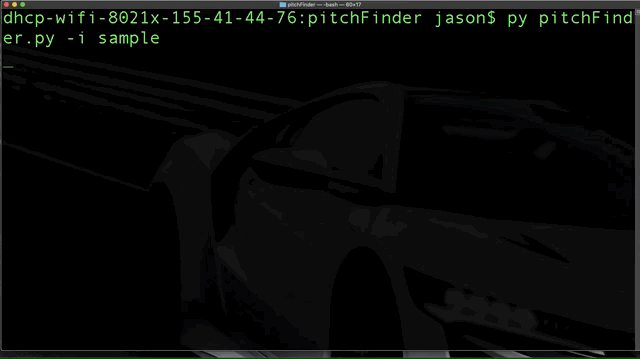
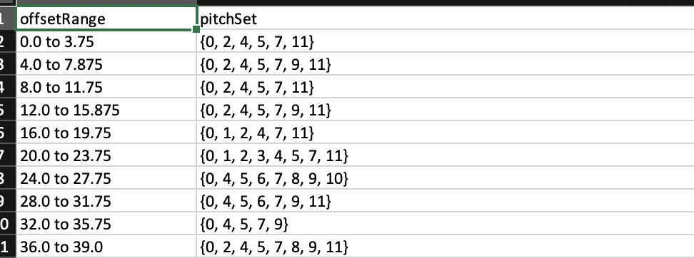

# YCAC-data-pitchSetFinder
Script allows find sets of pitches by user defined interval value of offset.

## Installing
Please install pip and run command line below in the same directory where 'requirements.txt' exists in order to install packages required to run. - ignored. install manually
```
$ pip install -r requirements.txt 
```
## Running the tests
Command looks like
```
$ python pitchFinder.py -i directory_name
```
>for example:
```
$ py pitchFinder.py -i sample

```
>Auto dir generator by composer's names
>>

>Final result looks like
>>

## Input & Output
Input
>Link to Yale Classical Archives
>>https://ycac.yale.edu/

Output
>Link to Google drive(private)

>Single csv file name format : "title by composer.csv"
>>https://drive.google.com/file/d/1NWwg0FcHZgk-8is8u8rEdqMOwYFiC0YT/view?usp=sharing
